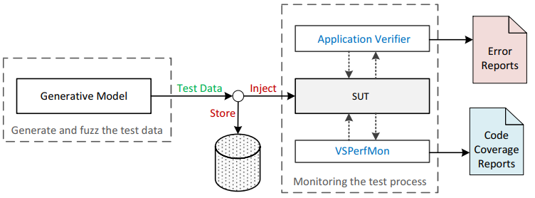
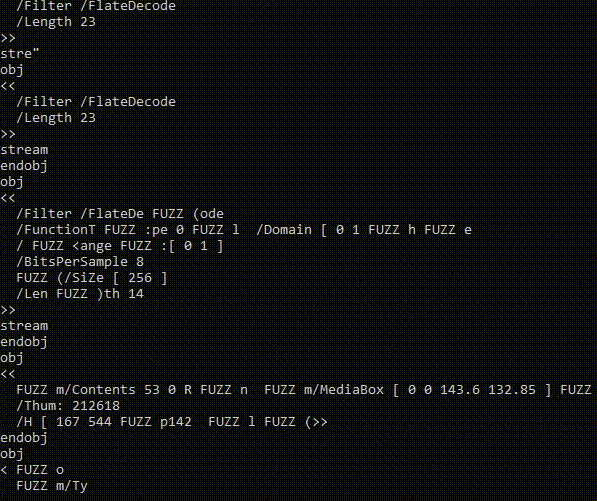

# IUST-DeepFuzz
Welcome to our new file format fuzzer, IUST-DeepFuzz, a fuzzing framework based on the deep neural languages. This project belongs to my master thesis in software engineering: ["Automatic test data generation in file format fuzzers"](https://1drv.ms/b/s!AmpQstTzvc-T003nHGvhCeNP_ZpH). We can automatically generate new, valid, and various complex structure files, mainly PDF files, as test data to use in dynamic testing of real world application, e.g. PDF reader applications. For more information about both the theoretical and practical aspect of IUST-DeepFuzz, refer to the IUST-DeepFuzz relevant paper and thesis as in the following:

* [Format-aware Learn&Fuzz: Deep Test Data Generation for Efficient Fuzzing](https://arxiv.org/abs/1812.09961v2)
* [Automatic Test Data Generation in File Format Fuzzers](https://1drv.ms/b/s!AmpQstTzvc-T003nHGvhCeNP_ZpH) (M.Sc. Thesis, in Persian)

## Thesis: Bring Deep Neural Network to Fuzz Testing
Fuzz testing (Fuzzing) is a dynamic software testing technique. In this technique with repeated generation and injection of malformed test data to the software under test (SUT), we are looking for possible faults and vulnerabilities. To this goal, fuzz testing requires varieties of test data. The most critical challenge is to handle the complexity of the file structures as program input. Surveys have revealed that many of the generated test data in these cases follow restricted numbers and superficial paths, because of being rejected by the parser of SUT in the initial stages of parsing. Using the grammatical structure of input files to generate test data lead to increase code coverage. However, often, the grammar extraction is performed manually, which is a time consuming, costly and error-prone task. 

In this thesis, we proposed an automated method for hybrid test data generation. To this aim, we apply neural language models (NLMs) that are constructed by recurrent neural networks (RNNs). The proposed models by using deep learning techniques can learn the statistical structure of complex files and then generate new textual test data, based on the grammar, and binary data, based on mutations. Fuzzing the generated data is done by two newly introduced algorithms, called neural fuzz algorithms that use these models. We use our proposed method to generate test data, and then fuzz testing of MuPDF complicated software which takes portable document format (PDF) files as input. To train our generative models, we gathered a large corpus of PDF files. Our experiments demonstrate that the data generated by this method leads to an increase in the code coverage, more than 7.0%, compared to state-of-the-art file format fuzzers such as American fuzzy lop (AFL). Experiments also indicate a better learning accuracy of simpler NLMS in comparison with the more complicated encoder-decoder model and confirm that our proposed models can outperform the encoder-decoder model in code coverage when fuzzing the SUT.

## Getting Started
In the current release (0.3.0) you can use IUST-DeepFuzz for test data generation and then fuzzing every application.

### Install
You need to have Python 3.6.x and and up-to-date TensorFlow and Keras frameworks on your computer.
* Install [Python 3.6.x](https://www.python.org/)
* Install [TensorFlow](https://www.tensorflow.org/)
* Install [Keras](https://keras.io/)
* Clone the IUST-DeepFuzz repository: `git clone https://github.com/m-zakeri/iust_deep_fuzz.git` or download the latest version https://github.com/m-zakeri/iust_deep_fuzz.git
* IUST-DeepFuzz is almost ready for test data generation!

### Running
* Configure the `config.py` work with your dataset and to set other paths settings.
* Find the script of specific algorithm that you need. 
* Run the script in command line: `python script_name.py`
* Wait until your file format learn and your test data is generate!

#### Available Pre-trained Models
A pre-trained model is a model that was trained on a large benchmark dataset to solve a problem similar to the one that we want to solve. For the time being, we provided some pre-trained model for *PDF file format*. Our best trained model is available at [model_checkpoint/best_models](model_checkpoint/best_models)

#### Availbale Fuzzing Scripts
ISUT-DeepFuzz has implemented four new deep models and two new fuzz algorithms: DataNeuralFuzz and MetadataNeuralFuzz as our contribution in mentioned thesis. The following algorithms to generate and fuzz test data are available in the current release (r0.3.0):
* `data_neural_fuzz.py`: To implement the DataNeuralFuzz algorithm for fuzzing data in the files.
* `metadata_neural_fuzz.py`: To implement MetadataNeuralFuzz for fuzzing metadata in the files.
* `learn_and_fuzz_3_sample_fuzz.py`: To implement SampleFuzz algorithm introduced in https://arxiv.org/abs/1701.07232. 

#### Available Dataset
Various file format for learning with IUST-DeepFuzz and then fuzz testing is available at [dataset directory](dataset).

## How It Works?

### Architecture
Figure 1. shows the architecture and data flow of IUST DeepFuzz. We designed and implemented IUST-DeePFUzz as a modular file format fuzzer. The main module of IUST DeepFuzz is a test data generator that implements our neural fuzz algorithms. The fuzzer injects test data to SUT and checks for unexpected results such as crash the memory of the SUT. IUST DeepFuzz uses Microsoft Application Verifier, a free runtime monitoring tool, as a monitoring module to catch any memory corruption. It also uses VSPerfMon, another tool from Microsoft, to measure code coverage.  Modules are connected using modest Python and batch scripts. 

>Figure 1. IUST-DeepFuzz architecture.

IUST-DeepFuzz in the above configuration can run on the Windows operating system but to use it on the other operating systems we just need to replace the monitoring tool, i.e., Application Verifier. The test data generator is written in Python and could be run on any platform. The code coverage measurement module is only used for evaluating purposes, and our fuzz testing does not need it. IUST DeepFuzz is a black box fuzzer with a hybrid test data generator. Each generated test data is stored on the disk before injection to SUT so whenever the monitoring module reports a crash, the test data which causes that crash can be retrieved to do fault localization process. 

### The Test Data Generation Process 
Figure 2. shows the process of generating new files. The file (in this figure PDF objects ) is generated character by character by sampling a trained model. You can see that the format of the file is completely preserved. *FUZZ* keyword appears in places that the predicted input has been replaced by the fuzzer. IUST-DeepFuzz finds both the place and the value of the fuzzed symbol automatically while generating the input. Other file formats such as HTML, CSS, XML, JSON, and all types of source codes can be produced in the same manner which is suitable for fuzzing and quick quality assurance of any software systems.

 
>Figure 2. The process of PDF object generation as test data.

### New Files
The result of the test data generation process in the previous section has been shown in Figure 3. In our experiments, we generated some new PDF files based on existing ones. The files on the left side are the valid PDF files served as the input of the IUST-DeepFuzz models and the files on the right side are generated PDF files during fuzzing. 

>Figure 3. Generated PDF files.

### FAQs
If you have got the IUST-DeepFuzz tool and have any questions, then feel free to send me an email (*m-zakeri@live.com*) and get more information. You may see the main [references](REFERENCES.md) or look at our large [test corpus](dataset).

*Last update: April 13, 2020*
